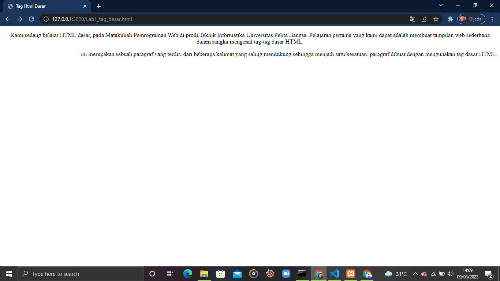

*Membuat Repository*
1. Login Github lalu buat Repository dengan judul Lab1Web

2. Clone URL Github Lab1Web

Setelah Clone maka di dalam folder Lab1Web terdapat file README 

*Membuat Web Dasar*
1. Buka Text editor (Text editor yang saya gunakan yaitu Visual Studio Code) 
2. Lalu pilih File pilih Open folder, dan buka folder yang di clone Tadi.

3. Maka Folder Lab1Web Terbuka

4. Lalu buat file baru dengan nama `lab1_tag_dasar.html`

5. dan buatlah Struktur HTML dan `lab1_tag_dasar.html`

6. Lalu buka Live Preview atau atau Jaringan Localhost di Browser

7. Ubah titel menjadi Tag HTML dasar

 
8. Membuat 2 Paragraf menggunkan tag 

Maka Tampilannya Sebagai Berikut

9. Kemudian mengatur atribut paragraf dengan menggunakan atribut align-center dan right

Dan tampilannya

10. Membuat judul halaman dengan tag h1 dan h2 dengan mengubah tampilan font

Lalu tampilannya

11. Menambahkan gambar pada dokumen menggunakan tag img

lalu tampilannya

12. Membuat link navigasi dengan menggunakan tag nav dan a

dan tampilan hyperlink 

*Lalu Push ke repository Github*
1. Buka gitbash di folder Lab1Wab

`git status -> untuk memeriksa apakah ada perubahan di repository`
`git add "nama file/folder" atau git add . -> untuk memasukan perubahan ke repository`
`git commit -m "pesan" -> untuk memberikan pesan atau deskripsi apa saja yang berubah`
`git push -> untuk mengirim file dari git bas ke github`

*Maka Folder tersebut sudah masuk di github*
